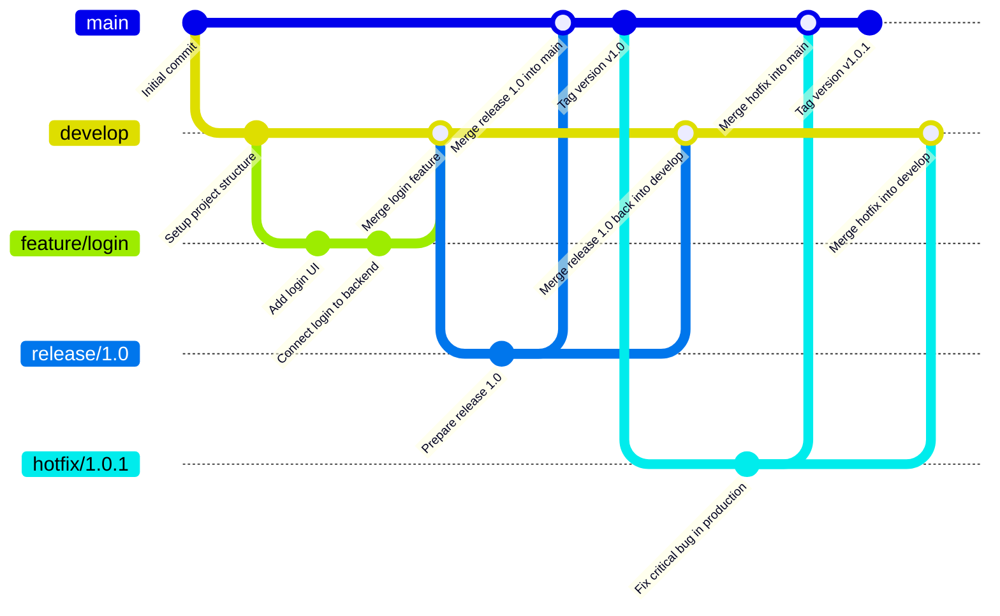

<a href="https://softserve.academy/"></a>

**_INSERT GRAPHIC HERE (include hyperlink in image)_**

# Repository Title Goes Here

> Subtitle or Short Description Goes Here

> ideally one sentence

> include terms/tags that can be searched

**Badges will go here**

- build status
- coverage
- issues (waffle.io maybe)
- devDependencies
- npm package
- slack
- downloads
- gitter chat
- license
- etc.

[](https://travis-ci.org/github/ita-social-projects/GreenCity)
[](https://coveralls.io)
[](https://github.com/Liatoshynsky-Foundation/lf-client/issues)
[](https://github.com/Liatoshynsky-Foundation/lf-client/pulls)
[](http://badges.mit-license.org)

- For more on these wonderful badges, refer to <a href="https://shields.io/" target="_blank">shields.io</a>.

---

## Table of Contents (Optional)

> If your `README` has a lot of info, section headers might be nice.

- [Installation](#installation)
  - [Required to install](#Required-to-install)
  - [Environment](#Environment)
  - [Clone](#Clone)
  - [Setup](#Setup)
  - [How to run local](#How-to-run-local)
  - [How to run Docker](#How-to-run-Docker)
- [Usage](#Usage)
  - [How to work with swagger UI](#How-to-work-with-swagger-UI)
  - [How to run tests](#How-to-run-tests)
  - [How to Checkstyle](#How-to-Checkstyle)
- [Documentation](#Documentation))
- [Contributing](#contributing)
  - [git flow](#git-flow)
  - [issue flow](#git-flow)
- [FAQ](#faq)
- [Support](#support)
- [License](#license)

---

## Installation

- All the `code` required to get started
- Images of what it should look like

### Required to install

- Python (3.6.3)
- PostgreSQL (9.5.9)
- Django (1.11.6)
- NodeJS (6.11.4)
- Redis (3.0.6)

### Environment

environmental variables

```properties
spring.datasource.url=${DATASOURCE_URL}
spring.datasource.username=${DATASOURCE_USER}
spring.datasource.password=${DATASOURCE_PASSWORD}
spring.mail.username=${EMAIL_ADDRESS}
spring.mail.password=${EMAIL_PASSWORD}
cloud.name=${CLOUD_NAME}
api.key=${API_KEY}
api.secret=${API_SECRET}
```

### Clone

- Clone this repo to your local machine using `git@github.com:Liatoshynsky-Foundation/lf-client.git`

### Setup

- If you want more syntax highlighting, format your code like this:

> update and install this package first

```shell
$ brew update
$ brew install SOMEREPOproductions
```

> now install npm and bower packages

```shell
$ npm install
$ bower install
```

- For all the possible languages that support syntax highlithing on GitHub (which is basically all of them), refer <a href="https://github.com/github/linguist/blob/master/lib/linguist/languages.yml" target="_blank">here</a>.

### How to run local

```bash
npm run dev
```

### How to run Docker

---

## Usage

### How to work with swagger UI

### How to run tests

### How to Checkstyle

---

## Documentation

### Folder structure

```markdown
app/
├── [lang]/
│ ├── events/
│ │ ├── page.tsx # /[lang]/events (list of events)
│ │ ├── [slug]/
│ │ │ └── page.tsx # /[lang]/events/:slug (individual event)
│ │ ├── layout.tsx # Optional layout for events
│ │ ├── components/ # Events-specific components
│ │ │ ├── Events.tsx
│ │ │ └── Event.tsx
│ ├── biography/
│ │ └── page.tsx # /[lang]/biography
│ ├── media-about-us/
│ │ └── page.tsx # /[lang]/media-about-us
│ ├── collaboration/
│ │ └── page.tsx # /[lang]/collaboration
├── shared/
│ ├── components/
│ │ ├── Header.tsx
│ │ └── Footer.tsx
│ └── hooks/
│ └── useAuth.ts
├── api/
│ ├── events/
│ │ ├── route.ts # /api/events (list, create)
│ │ └── [slug]/
│ │ └── route.ts # /api/events/:slug (read, update, delete)
├── models/
│ └── Event.ts # Mongoose Event schema and model
├── db/
│ └── connect.ts # MongoDB connection logic
├── middleware/
│ ├── logger.ts
│ └── authentication.ts
├── lib/
│ ├── axiosAPI.ts
│ └── db.ts # Optional alias to db/connect.ts
├── constants/
├── middleware.ts # Root-level middleware (i18n, auth)
```

---

## Contributing

### Git flow



> To get started...

#### Step 1

- **Option 1**
  g - 🍴 Fork this repo!

- **Option 2**
  - 👯 Clone this repo to your local machine using `https://github.com/ita-social-projects/SOMEREPO.git`

#### Step 2

- **HACK AWAY!** 🔨🔨🔨

#### Step 3

- 🔃 Create a new pull request using <a href="https://github.com/Liatoshynsky-Foundation/lf-client/compare/" target="_blank">github.com/Liatoshynsky-Foundation/lf-client</a>.

### Issue flow

---

## Team

> Or Contributors/People

[](https://github.com/lhalam)

- You can just grab their GitHub profile image URL
- You should probably resize their picture using `?s=200` at the end of the image URL.

---

## FAQ

- **How do I do _specifically_ so and so?**
  - No problem! Just do this.

---

## Support

Reach out to me at one of the following places!

- Website at <a href="http://Website.com" target="_blank">`Website.com`</a>
- Facebook at <a href="https://www.facebook.com/LiubomyrHalamaha/" target="_blank">`Liubomyr Halamaha`</a>
- Insert more social links here.

---

## License

[](http://badges.mit-license.org)

- **[MIT license](http://opensource.org/licenses/mit-license.php)**
- Copyright 2025 © <a href="https://softserve.academy/" target="_blank"> SoftServe Academy</a>.
