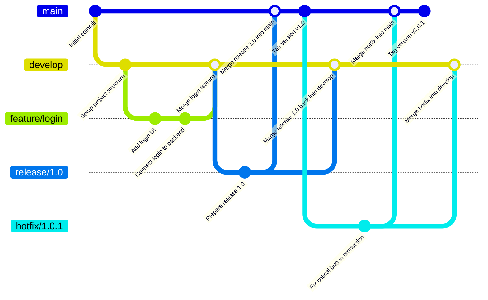

<a href="https://softserve.academy/"></a>


# Liatoshynsky Foundation

«Liatoshynsky Foundation» присвячений популяризації творчості Бориса Лятошинського – видатного українського композитора, представника модернізму та експресіонізму.

[](https://github.com/Liatoshynsky-Foundation/lf-client/issues)
[](https://github.com/Liatoshynsky-Foundation/lf-client/pulls)
[](http://badges.mit-license.org)

---

## Table of Contents

- [Installation](#installation)
  - [Required to install](#required-to-install)
  - [Environment](#environment)
  - [Clone](#clone)
  - [Setup](#setup)
  - [How to run local](#how-to-run-local)
  - [How to run Docker](#how-to-run-docker)
- [Usage](#usage)
  - [How to run tests](#how-to-run-tests)
  - [How to Checkstyle](#how-to-checkstyle)
  - [Turnstile Captcha](#turnstile-captcha)
  - [WayforPay Integration](#wayforpay-integration)
- [Documentation](#documentation)
- [Contributing](#contributing)
  - [git flow](#git-flow)
  - [issue flow](#git-flow)
- [Team](#team)
  - [Mentors](#mentors)
  - [Experts](#experts)
  - [Development team](#development-team)
  - [DevOps team](#devops-team)
  - [Designer team](#designer-team)
- [License](#license)

---

## Installation

---

## Turnstile Captcha

This project uses [Cloudflare Turnstile](https://www.cloudflare.com/products/turnstile/) for user verification before allowing donations. Turnstile is a privacy-focused captcha solution that helps prevent automated abuse while maintaining a smooth user experience.

- The captcha widget appears when a user initiates a donation.
- The backend verifies the token received from Turnstile before processing payment requests.
- See `TurnstileWidget` in the codebase for implementation details.

## WayforPay Integration

Donations are processed using [WayforPay](https://wayforpay.com/), a secure payment gateway widely used in Ukraine.

- When a donation is initiated and captcha verification succeeds, an invoice is created via the WayforPay API.
- The payment widget is loaded dynamically and presented to the user for completing the transaction.
- See the donation flow in `Donate.tsx` for integration details.

- All the `code` required to get started
- Images of what it should look like

### Required to install

- NodeJS (22.0.0)

### Environment

environmental variables

```properties
spring.datasource.url=${DATASOURCE_URL}
spring.datasource.username=${DATASOURCE_USER}
spring.datasource.password=${DATASOURCE_PASSWORD}
spring.mail.username=${EMAIL_ADDRESS}
spring.mail.password=${EMAIL_PASSWORD}
cloud.name=${CLOUD_NAME}
api.key=${API_KEY}
api.secret=${API_SECRET}
```

### Clone

- Clone this repo to your local machine using `git@github.com:Liatoshynsky-Foundation/lf-client.git`

### Setup

- If you want more syntax highlighting, format your code like this:

> update and install this package first

```shell
$ brew update
$ brew install SOMEREPOproductions
```

> now install npm and bower packages

```shell
$ npm install
$ bower install
```

- For all the possible languages that support syntax highlithing on GitHub (which is basically all of them), refer <a href="https://github.com/github/linguist/blob/master/lib/linguist/languages.yml" target="_blank">here</a>.

### How to run local

```bash
npm run dev
```

### How to run Docker

---

## Usage

### API Documentation

Documentation is rendered with [Redoc](https://redocly.github.io/redoc/) at `/api-docs`.

#### File Structure

```
app/
├── api/
│   ├── docs/
│   │   └── route.ts         # Combines all specs and serves OpenAPI JSON
│   └── [your-endpoint]/
│       ├── openapi.json     # Endpoint API specification
│       └── route.ts         # Endpoint API handler
└── api-docs/
    ├── layout.tsx           # Isolated layout for docs page
    └── page.tsx             # Redoc renderer
```

#### Adding New API Documentation

1. Create `openapi.json` in your endpoint folder:

```
   app/api/[your-endpoint]/openapi.json
```

2. Import and merge in `app/api/docs/route.ts`:

```ts
import newSpec from '../[your-endpoint]/openapi.json';

export async function GET() {
  return Response.json({
    // ... info, servers ...
    paths: {
      ...existingSpec.paths,
      ...newSpec.paths
    },
    components: {
      schemas: {
        ...existingSpec.components?.schemas,
        ...newSpec.components?.schemas
      }
    }
  });
}
```

3. Verify at `/api-docs`

### How to run tests

- To run all unit tests open terminal and run `npm run test` in it.
- To run single unit test file run `npm run test -- {component}.test.tsx`.

### How to Checkstyle

---

## Documentation

### Folder structure

```markdown
├── public/ # Static assets (icons, images, mock news images)
│ └── images/ # Categorized image assets (biography, events, partners)
├── app/ # Main application source (Next.js App Router)
│ ├── [lang]/ # Localization-based routing wrapper
│ │ ├── about-us/ # Foundation history and mission pages
│ │ ├── archive/ # Digital archives ([fund] and [case] dynamic routes)
│ │ ├── artistry/ # Creative and artistic activity sections
│ │ ├── biography/ # Liatoshynsky biography with interactive content
│ │ ├── contacts/ # Contact pages with feedback info
│ │ ├── news/ # Media center and foundation news
│ │ ├── research/ # Scientific research and publications section
│ │ └── war-in-ukraine/ # Dedicated section for current events/impact
│ ├── api/ # Server-side API routes (Route Handlers)
│ │ ├── compositions/ # CRUD for musical compositions (data, filters, titles)
│ │ ├── scientific-works/ # Management of scientific publications and filtering
│ │ ├── blob-url/ # Azure Storage integration for media URLs
│ │ ├── create-invoice/ # Payment and donation processing logic
│ │ └── health/ # API health monitoring endpoint
│ ├── di/ # Dependency Injection layer
│ │ └── modules/ # Inversify or custom DI module definitions
│ ├── domain/ # Core business logic and types
│ │ └── dto/ # Data Transfer Objects for API-Client communication
│ ├── infrastructure/ # Data Access Layer
│ │ ├── db/ # Database connection logic
│ │ ├── models/ # Database schemas (Archive, News, ScientificWorks)
│ │ └── repositories/ # Repository pattern for DB abstraction
│ ├── services/ # Application Business Services
│ │ ├── scientific-works/ # Business logic for scientific data
│ │ ├── email/ # Email sending services and templates
│ │ ├── pages-data/ # Dynamic content aggregation for various pages
│ │ └── upload/ # File handling and Azure Blob Storage services
│ ├── shared/ # Reusable core codebase
│ │ ├── components/ # Global UI Components
│ │ │ ├── design-system/ # Atomic components
│ │ │ ├── blocks/ # Complex UI sections
│ │ │ ├── tables/ # Advanced data tables
│ │ │ ├── forms/ # Specialized forms
│ │ │ ├── Header/ # Site navigation with AudioPlayer integration
│ │ │ ├── Footer/ # Multi-section footer with social media links
│ │ │ └── design-system/ # Atomic design system
│ │ ├── hooks/ # React hooks
│ │ ├── context/ # Global state management
│ │ ├── layouts/ # Shared page layouts
│ │ └── exceptions/ # Custom error handling and domain-specific errors
│ ├── types/ # Global TypeScript definitions, enums, and interfaces
│ ├── validators/ # Data validation schemas
│ └── middleware/ # Next.js middleware
```

---

## Contributing

### Git flow


```mermaid
gitGraph
   commit id: "Initial commit"
   branch develop
   checkout develop
   commit id: "Setup project structure"
   branch feature/login
   checkout feature/login
   commit id: "Add login UI"
   commit id: "Connect login to backend"
   checkout develop
   merge feature/login id: "Merge login feature"
   branch release/1.0
   checkout release/1.0
   commit id: "Prepare release 1.0"
   checkout main
   merge release/1.0 id: "Merge release 1.0 into main"
   commit id: "Tag version v1.0"
   checkout develop
   merge release/1.0 id: "Merge release 1.0 back into develop"

   checkout main
   branch hotfix/1.0.1
   checkout hotfix/1.0.1
   commit id: "Fix critical bug in production"
   checkout main
   merge hotfix/1.0.1 id: "Merge hotfix into main"
   commit id: "Tag version v1.0.1"
   checkout develop
   merge hotfix/1.0.1 id: "Merge hotfix into develop"

```

> To get started...

#### Step 1

- **Option 1**
  g - 🍴 Fork this repo!

- **Option 2**
  - 👯 Clone this repo to your local machine using `https://github.com/ita-social-projects/SOMEREPO.git`

#### Step 2

- **HACK AWAY!** 🔨🔨🔨

#### Step 3

- 🔃 Create a new pull request using <a href="https://github.com/Liatoshynsky-Foundation/lf-client/compare/" target="_blank">github.com/Liatoshynsky-Foundation/lf-client</a>.

### Issue flow

---

## Team

### Mentors

[](https://github.com/kolyasalubov)
[](https://github.com/vlad-khrychov)

### Experts

[](https://github.com/bandvov)
[](https://github.com/myevd)

### Development team

#### Team Lv-680.5

[](https://github.com/Mav-Ivan)

#### Team Lv-680.10

<a href="https://github.com/Mike-Popovych"></a>

#### Team Lv-680.11

[](https://github.com/Renatavl)

#### Team Lv-680.12

<a href="https://github.com/markgol777"></a>
[](https://github.com/VKormylo)
<a href="https://github.com/nebby2105"></a>
[](https://github.com/SofiiaYevush)
[](https://github.com/ArtemHolikov)
[](https://github.com/sandrvvu)

#### Team Lv-680.13

[](https://github.com/yur4uwe)
[](https://github.com/uliaescha)
[](https://github.com/Iarynovskyi)
[](https://github.com/danikua)
[](https://github.com/lizabre)
[](https://github.com/oleg191006)
<a href="https://github.com/TARDeus524"></a>
[](https://github.com/IrynaKhylchuk)
[](https://github.com/luvthenika)
[](https://github.com/irynalaitaruk)

#### Team UA-5044

[](https://github.com/ssashayurchenko)
<a href="https://github.com/bohuslavstan"></a>
[](https://github.com/Kryzhanivsky)

#### Team UA-5195

[](https://github.com/qqwz0)
[](https://github.com/NatalyKrvch)
[](https://github.com/stsvt)
[](https://github.com/Taras-ep)
[](https://github.com/ruslansymonenko)
[](https://github.com/alisa-korniienko)
[](https://github.com/LischenkoYaroslav)
[](https://github.com/MaksFullJs)
<a href="https://github.com/Xlopuk"></a>
[](https://github.com/kolibri753)
[](https://github.com/DenisGordProgrammer)
[](https://github.com/krxllll)

#### Team UA-5353

[](https://github.com/dest411)
[](https://github.com/kandyba)
[](https://github.com/Jevgan)
[](https://github.com/navimov)
[](https://github.com/Fedorieieva)
[](https://github.com/Th0mas-H0ward)

#### Team UA-5354

[](https://github.com/annak413)
[](https://github.com/LightOrden)
[](https://github.com/varenichek22)
[](https://github.com/dmitryzh100)
[](https://github.com/telare)
[](https://github.com/yuliiayarova)
[](https://github.com/vladashvch)
[](https://github.com/pALINchuk)
[](https://github.com/Halyna-Trush)
[](https://github.com/Yushchyk-Roman)
[](https://github.com/Fronik123)
[](https://github.com/premiumderyn)
[](https://github.com/dianajnxv)

### DevOps team

[](https://github.com/qwqw-333)
<a href="https://github.com/denchik911"></a>

### Designer team

[](https://github.com/Nastia197)
[](https://github.com/a-humanenko)
[](https://github.com/Valigura)
<a href="https://github.com/JuliaKharaim"></a>

---

## License

[](http://badges.mit-license.org)

- **[MIT license](http://opensource.org/licenses/mit-license.php)**
- Copyright 2025 © <a href="https://softserve.academy/" target="_blank"> SoftServe Academy</a>.
