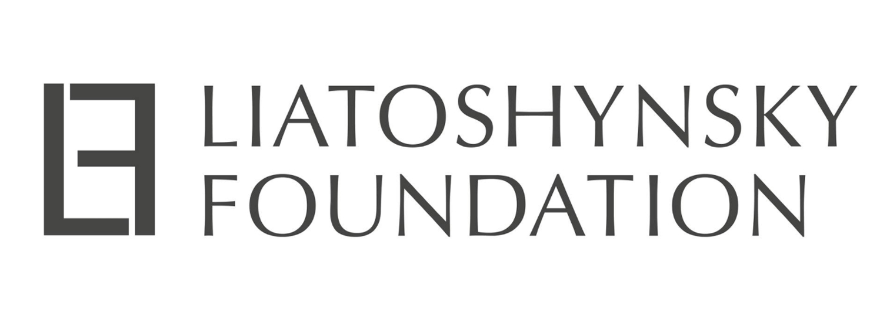
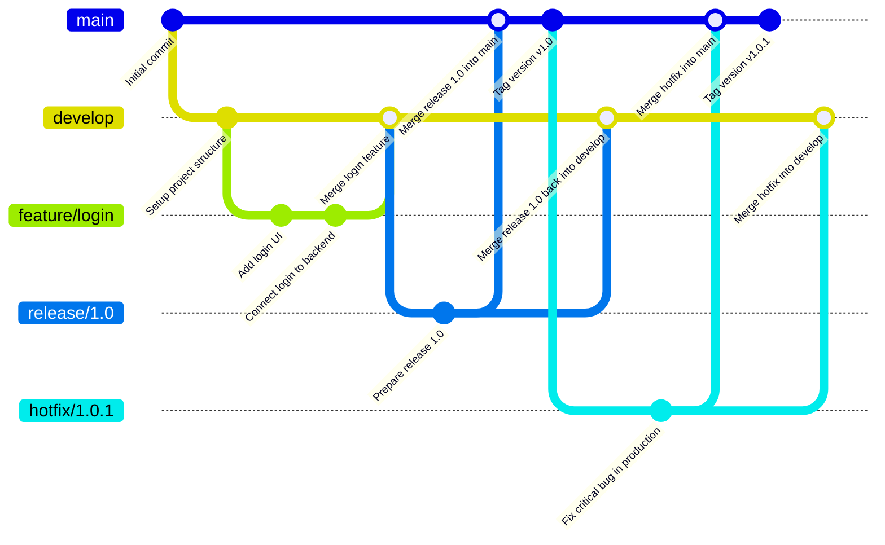

<a href="https://softserve.academy/"></a>



# Liatoshynsky Foundation

«Liatoshynsky Foundation» присвячений популяризації творчості Бориса Лятошинського – видатного українського композитора, представника модернізму та експресіонізму.

[](https://github.com/Liatoshynsky-Foundation/lf-client/issues)
[](https://github.com/Liatoshynsky-Foundation/lf-client/pulls)
[](http://badges.mit-license.org)

---

## Table of Contents

- [Installation](#installation)
  - [Required to install](#Required-to-install)
  - [Environment](#Environment)
  - [Clone](#Clone)
  - [Setup](#Setup)
  - [How to run local](#How-to-run-local)
  - [How to run Docker](#How-to-run-Docker)
- [Usage](#Usage)
  - [How to work with swagger UI](#How-to-work-with-swagger-UI)
  - [How to run tests](#How-to-run-tests)
  - [How to Checkstyle](#How-to-Checkstyle)
  - [Turnstile Captcha](#turnstile-captcha)
  - [WayforPay Integration](#wayforpay-integration)
- [Documentation](#Documentation)
- [Contributing](#contributing)
  - [git flow](#git-flow)
  - [issue flow](#git-flow)
- [Team](#team)
  - [Mentors](#mentors)
  - [Experts](#experts)
  - [Development team](#development-team)
  - [DevOps team](#devops-team)
  - [Designer team](#designer-team)
- [License](#license)

---

## Installation

---

## Turnstile Captcha

This project uses [Cloudflare Turnstile](https://www.cloudflare.com/products/turnstile/) for user verification before allowing donations. Turnstile is a privacy-focused captcha solution that helps prevent automated abuse while maintaining a smooth user experience.

- The captcha widget appears when a user initiates a donation.
- The backend verifies the token received from Turnstile before processing payment requests.
- See `TurnstileWidget` in the codebase for implementation details.

## WayforPay Integration

Donations are processed using [WayforPay](https://wayforpay.com/), a secure payment gateway widely used in Ukraine.

- When a donation is initiated and captcha verification succeeds, an invoice is created via the WayforPay API.
- The payment widget is loaded dynamically and presented to the user for completing the transaction.
- See the donation flow in `Donate.tsx` for integration details.

- All the `code` required to get started
- Images of what it should look like

### Required to install

- NodeJS (22.0.0)

### Environment

environmental variables

```properties
spring.datasource.url=${DATASOURCE_URL}
spring.datasource.username=${DATASOURCE_USER}
spring.datasource.password=${DATASOURCE_PASSWORD}
spring.mail.username=${EMAIL_ADDRESS}
spring.mail.password=${EMAIL_PASSWORD}
cloud.name=${CLOUD_NAME}
api.key=${API_KEY}
api.secret=${API_SECRET}
```

### Clone

- Clone this repo to your local machine using `git@github.com:Liatoshynsky-Foundation/lf-client.git`

### Setup

- If you want more syntax highlighting, format your code like this:

> update and install this package first

```shell
$ brew update
$ brew install SOMEREPOproductions
```

> now install npm and bower packages

```shell
$ npm install
$ bower install
```

- For all the possible languages that support syntax highlithing on GitHub (which is basically all of them), refer <a href="https://github.com/github/linguist/blob/master/lib/linguist/languages.yml" target="_blank">here</a>.

### How to run local

```bash
npm run dev
```

### How to run Docker

---

## Usage

### How to work with swagger UI

### How to run tests

- To run all unit tests open terminal and run `npm run test` in it.
- To run single unit test file run `npm run test -- {component}.test.tsx`.

### How to Checkstyle

---

## Documentation

### Folder structure

```markdown
app/
├── [lang]/
│ ├── events/
│ │ ├── page.tsx # /[lang]/events (list of events)
│ │ ├── [slug]/
│ │ │ └── page.tsx # /[lang]/events/:slug (individual event)
│ │ ├── layout.tsx # Optional layout for events
│ │ ├── components/ # Events-specific components
│ │ │ ├── Events.tsx
│ │ │ └── Event.tsx
│ ├── biography/
│ │ └── page.tsx # /[lang]/biography
│ ├── media-about-us/
│ │ └── page.tsx # /[lang]/media-about-us
│ ├── collaboration/
│ │ └── page.tsx # /[lang]/collaboration
├── shared/
│ ├── components/
│ │ ├── design-system/
│ │ │ └── button/
│ │ │ ├── Button.test.tsx
│ │ │ ├── Button.tsx
│ │ │ └── Button.styles.ts
│ │ ├── Header.tsx
│ │ └── Footer.tsx
│ └── hooks/
│ └── useAuth.ts
├── api/
│ ├── events/
│ │ ├── route.ts # /api/events (list, create)
│ │ └── [slug]/
│ │ └── route.ts # /api/events/:slug (read, update, delete)
├── models/
│ └── Event.ts # Mongoose Event schema and model
├── db/
│ └── connect.ts # MongoDB connection logic
├── middleware/
│ ├── logger.ts
│ └── authentication.ts
├── lib/
│ ├── axiosAPI.ts
│ └── db.ts # Optional alias to db/connect.ts
├── constants/
├── middleware.ts # Root-level middleware (i18n, auth)
├── config/
│ └── index.ts # Environment variable parsing and validation
```

---

## Contributing

### Git flow


```mermaid
gitGraph
   commit id: "Initial commit"
   branch develop
   checkout develop
   commit id: "Setup project structure"
   branch feature/login
   checkout feature/login
   commit id: "Add login UI"
   commit id: "Connect login to backend"
   checkout develop
   merge feature/login id: "Merge login feature"
   branch release/1.0
   checkout release/1.0
   commit id: "Prepare release 1.0"
   checkout main
   merge release/1.0 id: "Merge release 1.0 into main"
   commit id: "Tag version v1.0"
   checkout develop
   merge release/1.0 id: "Merge release 1.0 back into develop"

   checkout main
   branch hotfix/1.0.1
   checkout hotfix/1.0.1
   commit id: "Fix critical bug in production"
   checkout main
   merge hotfix/1.0.1 id: "Merge hotfix into main"
   commit id: "Tag version v1.0.1"
   checkout develop
   merge hotfix/1.0.1 id: "Merge hotfix into develop"

```

> To get started...

#### Step 1

- **Option 1**
  g - 🍴 Fork this repo!

- **Option 2**
  - 👯 Clone this repo to your local machine using `https://github.com/ita-social-projects/SOMEREPO.git`

#### Step 2

- **HACK AWAY!** 🔨🔨🔨

#### Step 3

- 🔃 Create a new pull request using <a href="https://github.com/Liatoshynsky-Foundation/lf-client/compare/" target="_blank">github.com/Liatoshynsky-Foundation/lf-client</a>.

### Issue flow

---

## Team

### Mentors

[](https://github.com/kolyasalubov)
[](https://github.com/vlad-khrychov)

### Experts

[](https://github.com/bandvov)
[](https://github.com/myevd)

### Development team

[](https://github.com/Mav-Ivan)
[](https://github.com/VKormylo)
[](https://github.com/SofiiaYevush)
[](https://github.com/yur4uwe)
[](https://github.com/uliaescha)
[](https://github.com/Iarynovskyi)
[](https://github.com/danikua)
[](https://github.com/lizabre)
[](https://github.com/oleg191006)
[](https://github.com/IrynaKhylchuk)
[](https://github.com/luvthenika)
[](https://github.com/irynalaitaruk)
[](https://github.com/Mike-Popovych)
[](https://github.com/TARDeus524)

### DevOps team

[](https://github.com/qwqw-333)
[](https://github.com/denchik911)

### Designer team

[](https://github.com/Nastia197)
[](https://github.com/a-humanenko)
[](https://github.com/Valigura)
[](https://github.com/JuliaKharaim)

---

## License

[](http://badges.mit-license.org)

- **[MIT license](http://opensource.org/licenses/mit-license.php)**
- Copyright 2025 © <a href="https://softserve.academy/" target="_blank"> SoftServe Academy</a>.
