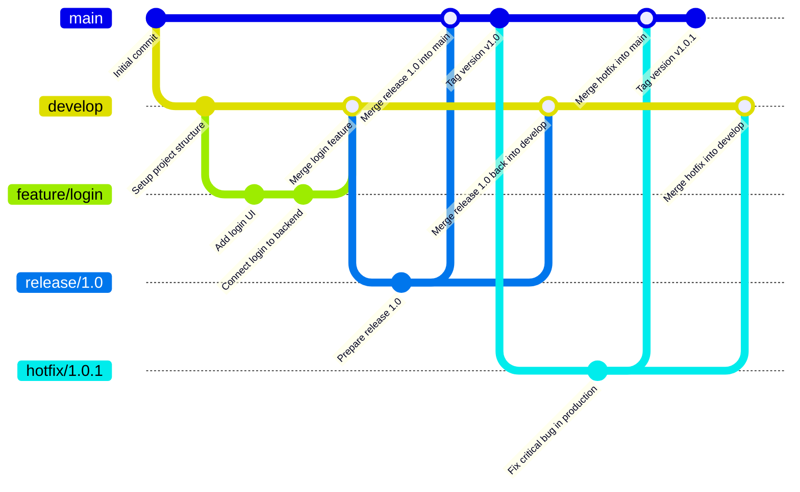

# Development Workflow

This guide explains our development workflow based on GitFlow. It's designed to help both new and existing team members understand how we manage code changes.

## Why GitFlow?

- Clear separation of development and production code
- Organized feature development
- Controlled release process
- Emergency fixes without disrupting development

## Visual GitFlow Example



## Branch Overview

### Core Branches

| Branch    | Purpose                                                           |
| --------- | ----------------------------------------------------------------- |
| `main`    | Production-ready code, always stable                              |
| `develop` | Integration branch for features, contains latest development code |

### Supporting Branches

| Type      | Created from | Merged into          | Purpose                                                                       |
| --------- | ------------ | -------------------- | ----------------------------------------------------------------------------- |
| `feature` | `develop`    | `develop`            | Developing new functionality                                                  |
| `chore`   | `develop`    | `develop`            | Non-feature tasks like refactoring, dependency updates, configuration changes |
| `bugfix`  | `develop`    | `develop`            | Fixing bugs found during development                                          |
| `hotfix`  | `main`       | `main` and `develop` | Fixing critical issues in production                                          |
| `release` | `develop`    | `main` and `develop` | Preparing a new release                                                       |

## Branch Naming & Creation

| Type      | Format                                  | Base Branch | Example Command                                        |
| --------- | --------------------------------------- | ----------- | ------------------------------------------------------ |
| `feature` | `feature/task-number/short-description` | `develop`   | `git switch -c feature/1234/add-login-ui develop`      |
| `chore`   | `chore/task-number/short-description`   | `develop`   | `git switch -c chore/1234/update-dependencies develop` |
| `bugfix`  | `bugfix/task-number/short-description`  | `develop`   | `git switch -c bugfix/23/fix-login-error develop`      |
| `release` | `release/version`                       | `develop`   | `git switch -c release/1.0.0 develop`                  |
| `hotfix`  | `hotfix/version`                        | `main`      | `git switch -c hotfix/1.0.1 main`                      |

> 💡 **Note**: Use kebab-case for short descriptions. Include task/issue ID if possible.

## Development Process

### 1. Synchronize local branches with remote

```bash
git fetch --all
```

### 2. Create a branch based on your task

Use the appropriate format from the table above depending on your task type.

### 3. Making Changes

- Make small, focused commits
- Follow our [commit message convention](conventional-commits.md)
- Keep your branch up to date with the base branch
- Test your changes thoroughly

### 4. Pushing Changes

```bash
git push -u origin feature/1234/add-new-feature
```

### 5. Creating Pull Requests

1. Go to GitHub repository
2. Click "New Pull Request"
3. Select:
   - Base branch: `develop` (for features/chore/bugfixes) or `main` (for hotfixes)
   - Compare branch: your feature branch
4. Add description following our PR template
5. Request review from team members

## Branch Protection Rules

To maintain code quality, we have the following protections:

### Main Branches

- No direct pushes allowed
- All changes must go through Pull Requests
- Required approvals: 3
- Required status checks:
  - Commit message validation
  - Branch name validation
  - Linting
  - Tests passing
  - Code coverage
  - Containerization check

## Common Issues and Solutions

### Branch is Out of Date

```bash
git switch develop
git pull
git switch feature/1234/add-new-feature
git rebase develop
```

### Commit Message Rejected

Check our [commit message convention](conventional-commits.md) and try again.

### Tests Failing

1. Run tests locally: `npm test`
2. Fix failing tests
3. Push changes: `git push`
